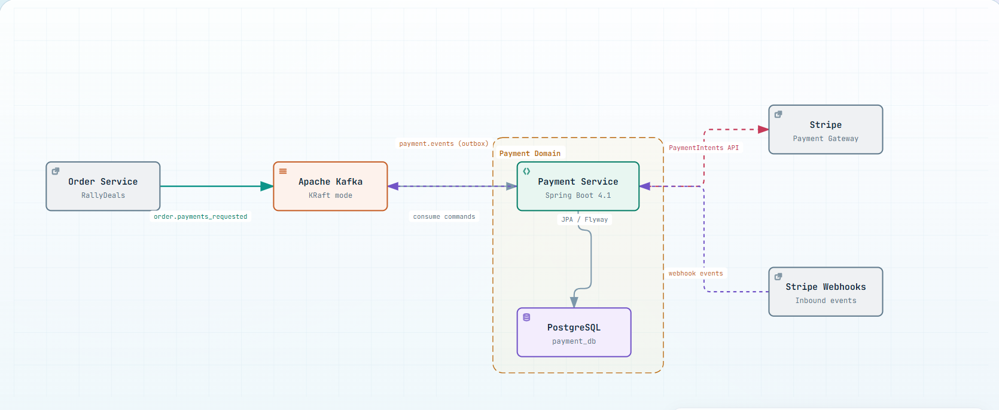

<div align="center">

# Rally Payments

Event-driven payment microservice for the **RallyDeals** platform.

[](https://openjdk.org/projects/jdk/21/)
[](https://spring.io/projects/spring-boot)
[](https://stripe.com)
[](https://www.postgresql.org/)
[](https://kafka.apache.org/)

[Overview](#overview) - [Architecture](#architecture) - [Getting Started](#getting-started) - [Configuration](#configuration) - [API Reference](#api-reference) - [Observability](#observability)

</div>

---

## Overview

Rally Payments orchestrates card-based payments through Stripe, manages saved payment methods (buyer wallet), and integrates with the RallyDeals ecosystem over Kafka using transactional outbox + inbox patterns.

**Key capabilities:**

- **Stripe-backed payments** — PaymentIntents for charge, authorize/capture, cancel (void), and fail-fast handling of 3DS / SCA (mapped to a failed payment in v1)
- **Saved payment methods** — buyer wallet built on Stripe SetupIntents with card fingerprinting for duplicate detection
- **Per-user Stripe customers** — automatic customer provisioning stored in `payment_profiles`
- **Reliable messaging** — transactional **outbox** for publishing and **inbox** for idempotent consumption of Kafka messages
- **Observability first** — Micrometer metrics, Prometheus, OTel tracing, structured JSON logging, custom health indicators, and correlation/trace propagation across HTTP and Kafka
- **Buyer-scoped API** — endpoints are scoped to the caller via the `X-User-Id` header

---

## Architecture

### System diagram



### Reliability patterns

- **Transactional Outbox**
  - Domain events + outbox row in same DB transaction
  - `OutboxRelay` polls every 1s with `FOR UPDATE SKIP LOCKED`
- **Inbox / Idempotency**
  - Kafka messages and Stripe webhooks deduplicated by message ID
  - Duplicate consumed messages silently skipped
- **Stripe Integration**
  - PaymentIntents for charge and authorize flows
  - SetupIntents for buyer wallet card storage
  - Lazy Stripe Customer provisioning per user

---

## Tech Stack

| Layer         | Technology                                                    |
| ------------- | ------------------------------------------------------------- |
| Runtime       | Java 21, Spring Boot 4.1.0, Spring MVC                        |
| Persistence   | Spring Data JPA, PostgreSQL 16, Flyway migrations             |
| Messaging     | Spring Kafka, Kafka (native KRaft broker)                     |
| Payments      | Stripe Java SDK 26.0.0                                        |
| Common        | `rally-common` (shared exceptions & contract) 0.3.0           |
| Observability | Micrometer, Prometheus, OpenTelemetry (OTLP), Logstash Logback|
| API Docs      | springdoc-openapi (Swagger UI)                                |
| Build         | Maven                                                         |

---

## Project Structure

```
src/main/java/com/rally/payment
├── api/
│   ├── controller/        # PaymentController, PaymentMethodController, StripeWebhookController
│   └── dto/               # request/response records
├── config/                # Stripe, Kafka, property classes
├── enums/                 # PaymentStatus, InboxMessageSource
├── events/                # domain events (PaymentCharged, PaymentFailed, ...)
├── exception/             # ApiExceptionHandler
├── filters/               # CorrelationIdFilter, HttpRequestLoggingFilter, KafkaCorrelationIdInterceptor
├── health/                # KafkaHealthIndicator, OutboxLagHealthIndicator
├── messaging/
│   ├── consumer/          # PaymentInitiationListener
│   ├── contract/          # message types, headers, payload records
│   ├── inbox/             # InboxMessage
│   └── outbox/            # OutboxMessage
├── metrics/               # PaymentMetrics
├── model/                 # Payment, PaymentMethod, PaymentMethodCard, PaymentProfile
├── relay/                 # OutboxRelay, OutboxPublisher
├── repository/            # Spring Data repositories
├── service/               # PaymentService, PaymentQueryService, PaymentMethodService,
│                          # PaymentProfileService, StripeProvisioningService,
│                          # StripeWebhookService, PaymentEventPublisher
└── stripe/                # StripePaymentGateway, StripeMetadata

src/main/resources/
├── db/migration/          # Flyway SQL migrations (V1..V12)
├── application.properties
└── logback-spring.xml
```

---

## Prerequisites

- **JDK 21**
- **Maven 3.9+**
- **Docker + Docker Compose**
- **Stripe account** (test keys) and optionally the [Stripe CLI](https://stripe.com/docs/stripe-cli)
- Access to the private `com.rally:rally-common` package (GitHub Maven Packages; add credentials to your Maven `settings.xml`)

---

## Getting Started

### 1. Configure environment

```bash
cp .env.example .env
```

> [!IMPORTANT]
> At minimum, you must set `STRIPE_API_KEY` and `STRIPE_WEBHOOK_SECRET` in your `.env` file.

### 2. Start infrastructure

```bash
docker compose up -d
```

This starts:

| Service     | Description                                      | Port     |
| ----------- | ------------------------------------------------ | -------- |
| Kafka       | `apache/kafka-native:4.0.1-rc2` (KRaft mode)   | `9092`   |
| Kafka UI    | Web UI for inspecting topics and messages        | `8080`   |
| PostgreSQL  | Payment database (`payment_db`)                  | `5433`   |
| Stripe CLI  | Forwards Stripe events to the payment service    | ---      |

> [!NOTE]
> The Stripe CLI forwards events to `host.docker.internal` because the payment service runs locally. The port and path follow `SERVER_PORT` / `STRIPE_WEBHOOK_PATH`.

### 3. Run the service

```bash
mvn spring-boot:run
```

The service starts on `http://localhost:8089`.

- **Swagger UI**: `http://localhost:8089/swagger-ui.html`
- **OpenAPI spec**: `http://localhost:8089/api-docs`

---

## Configuration

All settings are env-driven with sane defaults. `.env` is loaded via `spring.config.import=optional:file:.env[.properties]`.

| Variable                          | Default                                | Description                               |
| --------------------------------- | -------------------------------------- | ----------------------------------------- |
| `SERVER_PORT`                     | `8089`                                 | HTTP port of the payment service          |
| `STRIPE_API_KEY`                  | **(required)**                         | Stripe API key                            |
| `STRIPE_WEBHOOK_SECRET`           | **(required)**                         | Stripe webhook signing secret             |
| `STRIPE_WEBHOOK_PATH`             | `/api/v1/payments/webhook`             | Webhook endpoint path                     |
| `DB_HOST` / `DB_PORT`             | `localhost` / `5433`                   | PostgreSQL host / port                    |
| `DB_NAME` / `DB_USERNAME` / `DB_PASSWORD` | `payment_db` / `user` / `password` | Database credentials              |
| `KAFKA_BOOTSTRAP_SERVERS`         | `localhost:9092`                       | Kafka bootstrap servers                   |
| `LOGGING_LEVEL_RALLY`              | `INFO`                                 | Business logging level (com.rally.payment)|
| `LOGGING_LEVEL_ROOT`               | `INFO`                                 | Root log level                            |
| `MANAGEMENT_HEALTH_SHOW_DETAILS`  | `always`                               | Actuator health detail exposure           |
| `OTEL_EXPORTER_OTLP_ENDPOINT`     | `http://localhost:4318/v1/traces`      | OTLP trace exporter endpoint              |

> [!TIP]
> The default currency is set via `stripe.currency=egp` in `application.properties`.

---

## Kafka Messaging Contract

### Consumed topic: `order.payments_requested`

Messages carry the message type in the `X-Type` header:

| Message type                            | Payload                                     | Behavior                       |
| --------------------------------------- | ------------------------------------------- | ------------------------------ |
| `Payment.InitRequired.Charge`           | `{ userId, orderId, paymentMethodId, amount }` | Create payment and charge   |
| `Payment.InitRequired.Authorize`        | `{ userId, orderId, paymentMethodId, amount }` | Create payment and authorize |
| `Payment.SettlementRequired.Capture`    | `{ paymentId, orderId }`                    | Capture an authorized payment  |
| `Payment.SettlementRequired.Void`       | `{ paymentId, orderId }`                    | Void / release held funds      |
| `Payment.Timeout`                       | `{ orderId }`                               | Resolve settlement timeout     |

### Published topic: `payment.events`

Published via the outbox relay:

`Payment.Charged`, `Payment.Captured`, `Payment.Authorized`, `Payment.Failed`, `Payment.Voided`

> [!NOTE]
> `Payment.Initialized` and `Payment.RequiresAction` are intentionally **not** published — the order-payment contract does not map them.

### Standard headers

| Header             | Meaning                                |
| ------------------ | -------------------------------------- |
| `X-Id`             | Unique message id                      |
| `X-Type`           | Message type (see above)               |
| `X-Correlation-Id` | Correlation id (order id by default)   |
| `traceparent`      | W3C trace context for distributed tracing |

---

## Payment Lifecycle

```
 PENDING ──▶ REQUIRES_ACTION ──▶ FAILED   (3DS / SCA not supported in v1)
    │
    ├──▶ AUTHORIZED ──▶ CAPTURED
    │         │
    │         └──▶ VOIDED        (manual void / settlement timeout)
    ├──▶ CHARGED
    │
    └──▶ FAILED
```

> [!NOTE]
> `REQUIRES_ACTION` (3DS / SCA) is not supported in v1. When Stripe responds with `requires_action`, the payment is failed directly (see `PaymentService`). The `PAYMENT` aggregate defines a `requireAdditionalAction` transition, but it is not wired to any current flow, so `REQUIRES_ACTION` is not reachable in normal operation.

**Statuses**: `PENDING`, `AUTHORIZED`, `CHARGED`, `CAPTURED`, `FAILED`, `VOIDED`, `REQUIRES_ACTION`, `REFUNDED`, `PARTIALLY_REFUNDED`

---

## API Reference

All request/response bodies are JSON. Payment-method and user-scoped payment endpoints require the `X-User-Id` header (buyer identity) instead of a path `userId`.

### Payments — `/api/payments`

| Method | Path                                    | Description                        |
| ------ | --------------------------------------- | ---------------------------------- |
| `POST` | `/api/payments`                         | Create a payment (returns `201`)   |
| `GET`  | `/api/payments/{paymentId}`             | Get a payment by id                |
| `GET`  | `/api/payments/user/{userId}`           | List payments for a user           |
| `GET`  | `/api/payments/order/{orderId}`         | List payments for an order         |
| `POST` | `/api/payments/{paymentId}/authorize`   | Authorize a payment                |
| `POST` | `/api/payments/{paymentId}/capture`     | Capture an authorized payment      |
| `POST` | `/api/payments/{paymentId}/fail`        | Mark a payment as failed           |
| `POST` | `/api/payments/{paymentId}/void`        | Void a payment                     |

**Create payment request body:**

```json
{
  "paymentMethodId": "pm_...",
  "userId": "00000000-0000-0000-0000-000000000000",
  "orderId": "00000000-0000-0000-0000-000000000000",
  "amount": 100.00
}
```

### Saved payment methods — `/api/payment-methods`

| Method   | Path                                       | Description                              |
| -------- | ------------------------------------------ | ---------------------------------------- |
| `GET`    | `/api/payment-methods`                     | List the buyer's saved methods (masked)  |
| `GET`    | `/api/payment-methods/{methodId}`          | Get one saved method                     |
| `POST`   | `/api/payment-methods/setup-intent`        | Start adding a card (Stripe SetupIntent) |
| `POST`   | `/api/payment-methods`                     | Confirm a SetupIntent and save the method|
| `PUT`    | `/api/payment-methods/{methodId}/default`  | Set default method                       |
| `DELETE` | `/api/payment-methods/{methodId}/default`  | Clear the default flag                   |
| `DELETE` | `/api/payment-methods/{methodId}`          | Hard-delete a saved method               |

> [!IMPORTANT]
> Responses never expose the raw Stripe token. Card details are returned masked: `cardBrand`, `cardLast4`, `cardExpMonth`, `cardExpYear`, `cardFingerprint`.

### Stripe webhook

`POST {stripe.webhook-path}` (default `/api/v1/payments/webhook`)

Handled event types: `payment_intent.succeeded`, `payment_intent.canceled`, `payment_intent.payment_failed`, `setup_intent.succeeded`.

---

## Observability

| Endpoint                          | Description                                                                                     |
| --------------------------------- | ----------------------------------------------------------------------------------------------- |
| `/actuator/prometheus`            | Micrometer metrics (payment counters, outbox gauges, webhook timers, Kafka event counters)       |
| `/actuator/health`                | Custom `KafkaHealthIndicator` and `OutboxLagHealthIndicator`                                     |
| `/actuator/metrics`               | Application metrics                                                                             |
| `/actuator/info`                  | Application info                                                                                |

- **Tracing** — OpenTelemetry via Micrometer tracing bridge with OTLP exporter. Kafka observation propagates W3C `traceparent` automatically. `OutboxRelay` re-parents outbox publishes to the stored `trace_id` so relayed messages keep the same trace.
- **Logging** — plain text for `local`/`dev` profiles, JSON (Logstash encoder) elsewhere. Rolling file appender to `logs/payment-service.log`. MDC keys (`traceId`, `spanId`) are populated automatically by the OTel bridge.

---

## Database

Flyway migrations run automatically on startup with `ddl-auto=validate`.

Migrations live in `src/main/resources/db/migration` (`V1__initial_schema.sql` ... `V12__seed_mock_payment_methods.sql`).

**Key tables:** `payments`, `payment_methods`, `payment_profiles`, `inbox_messages`, `outbox_messages`

> [!CAUTION]
> Keep migrations additive. Never edit an already-applied migration.
